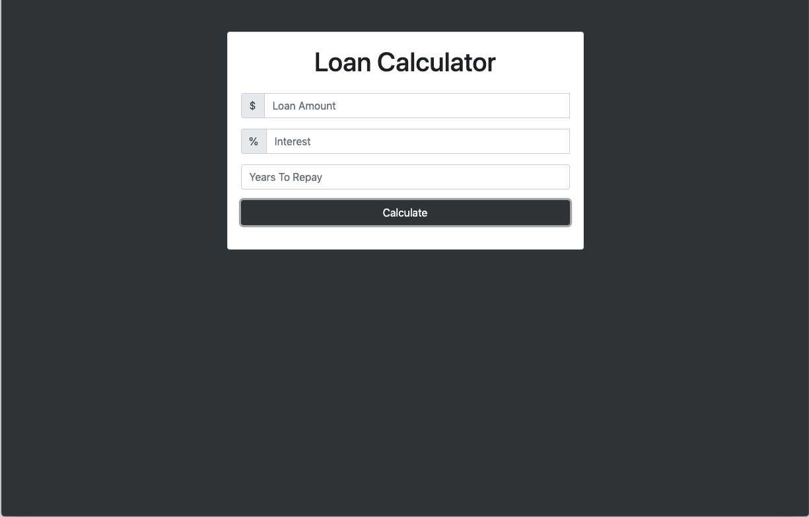
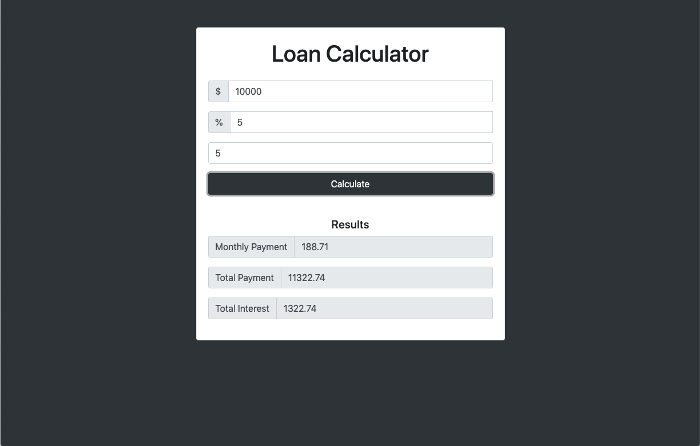

<h1 align="center">Loan Calculator</h1>

A loan calculator built with JavaScript

## Table of Contents
* [Project Status](#project-status)
* [Technologies](#technologies)
* [Key concepts covered](#key-concepts-covered)
* [Features](#features)
* [Screenshots](#screenshots)

## Project Status
This project is currently: _Complete_

## Technologies
Built with:
* HTML
* CSS
* JavaScript

## Key concepts covered
1. document.querySelector()
2. setInterval()
3. Math.pow()
4. toFixed()
5. parseFloat()
6. DOM manipulation
7. JavaScript CSS Manipulation
8. eventListener()

## Features
Complete:
* Users can enter a loan amount, interest rate, and years to repay
* Loading animation displays upon submission
* Calculates and displays the results for monthly payment, total payment, and total interest
* An error message displays if the input is invalid

## Screenshots

